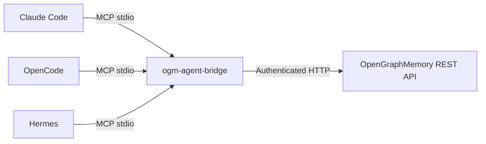

# ogm-agent-bridge

[](https://github.com/ardiannurcahya/ogm-agent-bridge/actions/workflows/ci.yml)
[](https://www.python.org/)
[](LICENSE)
[](https://github.com/ardiannurcahya/ogm-agent-bridge)

**MCP stdio bridge for [OpenGraphMemory](https://github.com/ardiannurcahya/open-graph-memory).**

Connect one OpenGraphMemory project to Claude Code, OpenCode, or Hermes.

Keep agents away from direct database, vector-store, graph-store, and object-store access.



`ogm-agent-bridge` validates tool input, enforces local permissions, calls core REST APIs, and keeps required local session mappings in SQLite.

It exposes no destructive, admin, project-creation, or direct-storage tools.

> **Status: Alpha.** Source install is supported path. Package version is `0.1.0`; no `v0.1.0` tag or PyPI publication exists.

## Why this bridge

- **Native MCP transport.** One stdio server works with Claude Code, OpenCode, and Hermes.
- **Project isolation.** One bridge process serves one configured OpenGraphMemory project.
- **Least privilege.** `read-only` and `personal-safe` profiles. No `full` profile.
- **Controlled local uploads.** Files must be regular files under configured approved roots.
- **Safe state handling.** Local SQLite stores bridge-to-core session mappings and provisioned identity state, never API keys.
- **Core-first design.** Calls OpenGraphMemory REST only; no direct backing-store access.

## What agents can do

- Ask grounded questions over one dataset with vector, graph, or hybrid retrieval.
- Inspect available datasets before choosing retrieval target.
- Search stored memory for lexical matches in known user, agent, or core-session scope.
- Create isolated memory session, then save one message and one fact per `ogm_remember` call.
- Upload reviewed documentation from approved local roots into selected dataset.
- Check core reachability before starting task.

Agents cannot delete or update data, create projects, administer core, or access backing stores.

## Toolset

| Tool | Purpose | Profile |
|---|---|---|
| `ogm_health` | Check core health. | read |
| `ogm_list_datasets` | List project datasets. | read |
| `ogm_query` | Retrieve and query dataset content. | read |
| `ogm_search_memory` | Search core memory. | read |
| `ogm_create_session` | Create mapped memory session. | `personal-safe` |
| `ogm_remember` | Store one message and one fact for bridge session. | `personal-safe` |
| `ogm_upload_document` | Upload approved local file to dataset. | `personal-safe` |

Full schemas, examples, response envelopes, and error codes: **[MCP tools](docs/tools.md)**.

## Quick start

### Requirements

- Supported Python: 3.11, 3.12, or 3.13.
- [uv](https://docs.astral.sh/uv/).
- Reachable OpenGraphMemory core service.
- OpenGraphMemory project API key and project UUID.

### Install and run from source

```bash
git clone https://github.com/ardiannurcahya/ogm-agent-bridge.git "$HOME/src/ogm-agent-bridge"
cd "$HOME/src/ogm-agent-bridge"
uv sync --locked
cp .env.example .env
```

Edit `.env` with core connection values:

```env
OGM_BASE_URL=http://localhost:8000
OGM_API_KEY=<project-api-key>
OGM_PROJECT_ID=<project-uuid>
OGM_PERMISSION_PROFILE=personal-safe
# OGM_UPLOAD_ROOTS=/home/me/project/docs
```

Start bridge:

```bash
uv run ogm-agent-bridge
```

Bridge uses MCP **stdio** transport. Keep stdout reserved for MCP protocol. Diagnostics go to stderr.

`uvx ogm-agent-bridge` works only after PyPI publication.

## Connect your agent

Use source command above in harness MCP configuration. Harness guides include copyable configuration:

- [Claude Code](docs/claude-code.md)
- [OpenCode](docs/opencode.md)
- [Hermes](docs/hermes.md)

See [configuration reference](docs/configuration.md) for environment variables, named project setups, permission profiles, state location, and upload roots.

## First workflow

1. Configure `OGM_BASE_URL`, `OGM_API_KEY`, and `OGM_PROJECT_ID`.
2. Register bridge with MCP harness.
3. Call `ogm_health`, then `ogm_list_datasets` to verify service and project access.
4. Call `ogm_query` with dataset ID and question.
5. For memory writes, call `ogm_create_session`; retain returned bridge `session_id`; call `ogm_remember` with that ID.
6. Upload only reviewed files with `ogm_upload_document`.

Important session rule: `ogm_create_session` returns bridge `session_id` for `ogm_remember`. `ogm_query` and `ogm_search_memory` accept **core** memory IDs, not bridge session IDs. Details: [session lifecycle](docs/session-lifecycle.md).

## MCP argument examples

These blocks are MCP tool **arguments**, not shell commands.

Replace placeholder IDs and paths with values for configured project.

### `ogm_query`: hybrid retrieval

```json
{"dataset_id":"11111111-1111-1111-1111-111111111111","query":"What is retention policy?","mode":"hybrid","top_k":5,"memory_session_id":"core-session-id","memory_top_k":5}
```

`memory_session_id` above is core memory ID. Do not pass bridge `session_id` returned by `ogm_create_session`.

### `ogm_create_session`: create mapped session

```json
{"user_external_id":"me@example.com","agent_name":"claude-code","user_display_name":"Me","agent_description":"Coding assistant","title":"bridge docs","user_metadata":{"team":"docs"},"agent_metadata":{"harness":"claude"},"session_metadata":{"repo":"ogm-agent-bridge"}}
```

Response supplies bridge `session_id` plus core IDs. Retain bridge `session_id` for next tool.

### `ogm_remember`: write message and fact

```json
{"session_id":"bridge-session-id","message":{"role":"user","content":"Use uv for this project.","metadata":{"source":"chat"}},"fact":{"scope":"user","subject":"project","predicate":"uses","value":"uv","confidence":100,"metadata":{"verified":true}}}
```

This sends exactly one message and one fact through mapped bridge session.

### `ogm_upload_document`: approved local file

```json
{"dataset_id":"11111111-1111-1111-1111-111111111111","path":"/home/me/project/docs/guide.md","filename":"guide.md","mime_type":"text/markdown"}
```

`path` must name regular local file inside `OGM_UPLOAD_ROOTS`. Full argument rules: [MCP tools](docs/tools.md).

## Responses, citations, and provenance

Tool success uses envelope with `ok`, `data`, optional `provenance`, and `warnings`.

`ogm_query` preserves core query data, which can include answer, citations, retrieval trace, and usage information.

Citation shape and availability come from core response; bridge does not invent citations.

Use citations to connect answer claims back to retrieved source material when core supplies them.

`retrieval_trace` is core retrieval diagnostic data when core supplies it. Trace content can help inspect retrieval path, but is not stable bridge-defined output contract.

`provenance` contains known bridge context only. Possible known keys include `project_id`, `dataset_id`, `session_id`, and `trace_id`. Keys appear only when known.

Read response envelope details in [MCP tools](docs/tools.md).

## Permissions and security

| Capability | `read-only` | `personal-safe` |
|---|---:|---:|
| Health, datasets, query, memory search | allow | allow |
| Create session, remember, upload document | deny | allow |
| Delete, update, admin, project creation | no tool | no tool |

Use `read-only` unless writes are required. Permission profiles are local guardrails; OpenGraphMemory authorization remains final boundary.

### Uploads cross trust boundary

`ogm_upload_document` reads selected local file and sends bytes to configured OpenGraphMemory endpoint. Set narrow `OGM_UPLOAD_ROOTS`.

Do not use `$HOME`, `/`, broad repository roots, or shared temporary directories. Review path, resolved symlink target, filename, and content before upload.

Keep `.env`, API keys, SSH material, browser profiles, build secrets, and SQLite state outside upload roots.

Read [security guidance](docs/security.md) before enabling uploads.

## Configuration at glance

| Variable | Required | Default |
|---|---:|---|
| `OGM_BASE_URL` | yes | — |
| `OGM_API_KEY` | yes | — |
| `OGM_PROJECT_ID` | yes | — |
| `OGM_TIMEOUT_SECONDS` | no | `30.0` |
| `OGM_MAX_RETRIES` | no | `2` |
| `OGM_STATE_DB` | no | `~/.local/state/ogm-agent-bridge/state.db` |
| `OGM_PERMISSION_PROFILE` | no | `personal-safe` |
| `OGM_UPLOAD_ROOTS` | no | process working directory |

Project calls send `X-API-Key` and `X-Project-Id`. `ogm_health` calls unauthenticated `/health`. Bridge loads `.env` without replacing values already present in environment.

One process maps to one project. For multiple projects, run separate processes with isolated environment files, SQLite state databases, API keys, and upload roots. Full reference: [configuration](docs/configuration.md).

## Architecture

```text
Claude Code ─┐
OpenCode ────┼─ MCP stdio ─ tool handler ─ HTTP client ─ OpenGraphMemory REST
Hermes ──────┘                 │                 │
                               └─ SQLite state ───┘
```

SQLite holds harness-facing session mappings plus provisioned core user and agent IDs. It does not hold project API key.

Back up state carefully: core has no public user/agent lookup or list-session API, so state loss can make mappings ambiguous.

After ambiguous memory write failure, bridge blocks later writes for bridge session until outcome is inspected and repaired.

Read [architecture](docs/architecture.md) and [backup and recovery](docs/backup-recovery.md) before operating stateful memory writes.

## Quality

Last verified local suite: **59 passed, 1 optional real-core smoke skipped**.

CI tests Python 3.11, 3.12, and 3.13.

CI package job runs formatting, lint, and type checks.

It builds package, runs `twine check`, and installs clean wheel for CLI version smoke.

MCP tools-list coverage is part of test suite.

Optional real-core smoke stays skipped unless explicit environment opt-in supplies isolated core configuration.

Smoke starts no Docker and reads no credential files.

Read [conformance](docs/conformance.md) for scope and limits.

### Validate checkout

Run gates serially:

```bash
uv sync --dev --locked
uv run ruff format --check .
uv run ruff check .
uv run mypy src
uv run pytest -q
uv build
uvx twine==6.1.0 check dist/*
```

Build output lives in `dist/`.

Remove it after local package validation if needed.

## Known limitations

- Alpha project; interfaces can change before stable release.
- Memory search is lexical, not semantic.
- One bridge process serves one OpenGraphMemory project.
- Bridge does not auto-ingest conversations from harness.
- No destructive tools: no delete, update, admin, or project-creation operations.
- Bridge `session_id` works only for `ogm_remember`; query and search require core memory IDs.
- Package version exists, but release tag and PyPI publication do not.
- OpenGraphMemory core deployment is separate responsibility; bridge does not deploy core or backing services.

## Project structure

```text
src/ogm_agent_bridge/  Bridge package, MCP server, core client, state, permissions
tests/                 Unit, conformance, harness, and optional real-core smoke tests
docs/                  Setup, security, operations, API, and release guides
.github/workflows/     CI and tag-gated release workflows
pyproject.toml         Package metadata, dependencies, and tool settings
README.md              Project landing page
```

## Documentation

| Topic | Document |
|---|---|
| Tool schemas, examples, errors | [MCP tools](docs/tools.md) |
| Environment and project configs | [Configuration](docs/configuration.md) |
| Harness setup | [Claude Code](docs/claude-code.md) · [OpenCode](docs/opencode.md) · [Hermes](docs/hermes.md) |
| Session ID behavior | [Session lifecycle](docs/session-lifecycle.md) |
| Credentials, permissions, uploads | [Security](docs/security.md) |
| State backup and recovery | [Backup and recovery](docs/backup-recovery.md) |
| Common failures | [Troubleshooting](docs/troubleshooting.md) |
| Capacity planning | [Resource guidance](docs/resource-guidance.md) |
| Updates and removal | [Upgrade and uninstall](docs/upgrade-uninstall.md) |
| Design and API scope | [Architecture](docs/architecture.md) · [Core API audit](docs/api-audit.md) · [Conformance](docs/conformance.md) |
| Release process | [Release](docs/release.md) |

## License

MIT. See [LICENSE](LICENSE).
